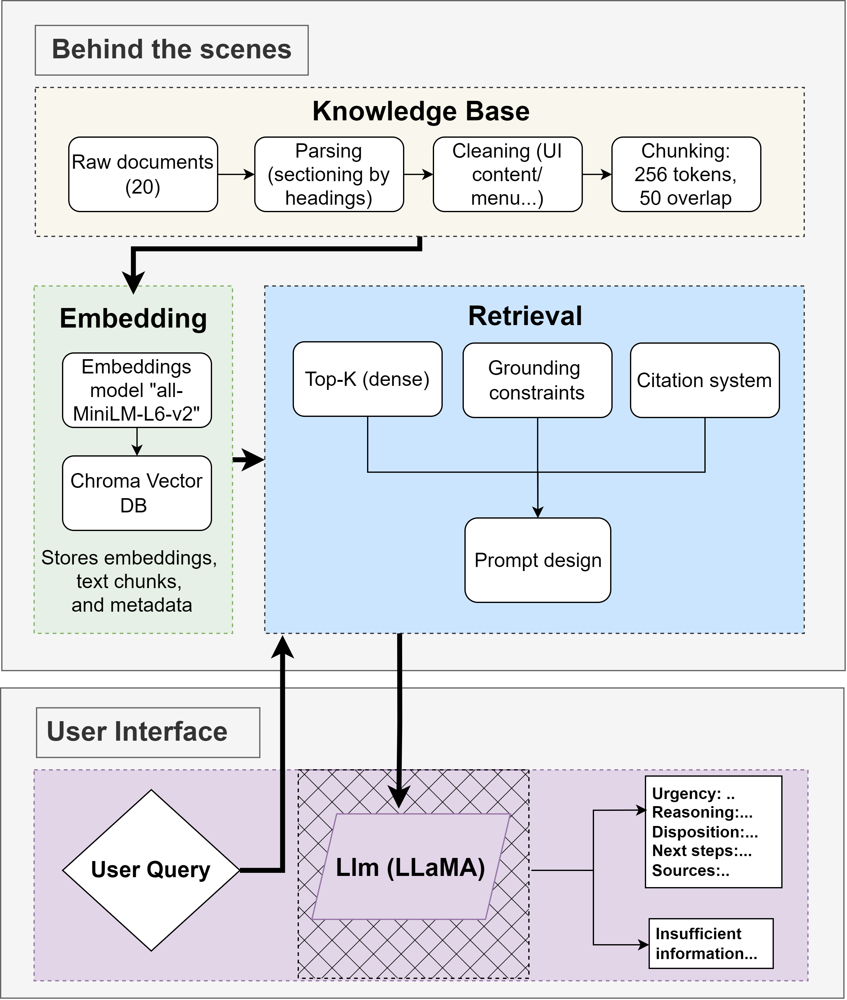

# Assignment 2 - Emergency Room Triage LLM System

## Overview
This project implements a healthcare triage system using LLMs to help nurses classify patient in the emergency room into:

- Self-care
- Routine
- Urgent

Two systems are evaluated:
- A1 (Baseline)
- A2 (RAG-based Enhanced Model)

---
## Workflow Pipeline

 

## Project Structure

A2_Malek_Yomna/
- Part A-C/
  - LLM_Assignment2_Malek_Yomna.ipynb
  - a1_results.txt
  - a2_rag_results.txt
  - testcases_assignment_2.json
  - chroma_db_phase2/
  - cleaned_docs_phase2/
  - chunked_docs_phase2.json

- Streamlit_app/
  - app.py
  - chroma_db_phase2/
  - requirements.txt

- DEMO.mp4
- README.md

---

## Features

- Triage classification into 3 urgency levels
- RAG-based enhancement
- Evaluation on test cases
- Confusion matrix analysis
- A1 vs A2 comparison
- Streamlit app interface

---

## Results Summary

- A1 shows hallucination (adds info not in input)
- A2 improves grounding but has retrieval errors
- Most errors occur in borderline cases (Routine vs Urgent)
- Models tend to over-triage (safer than under-triage)

---

## Demo

See:
DEMO.mp4

---

## How to Run

Install dependencies:
pip install -r Streamlit_app/requirements.txt

Run the app:
streamlit run Streamlit_app/app.py

---

## Authors

Malek Chabbouh  
Yomna
